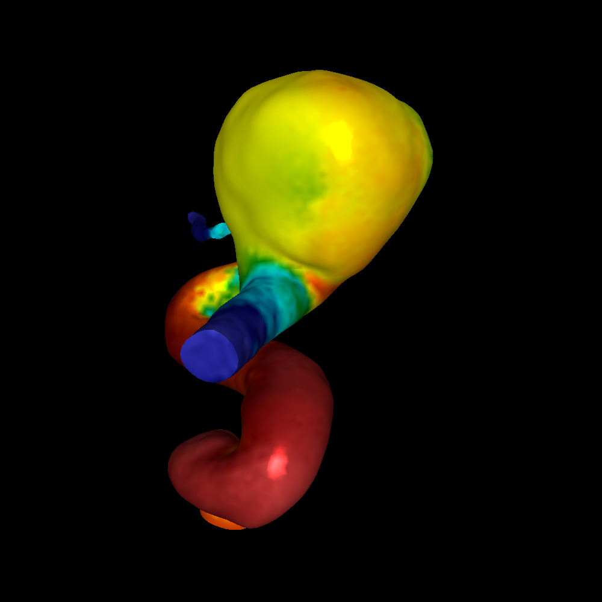
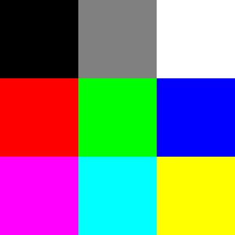
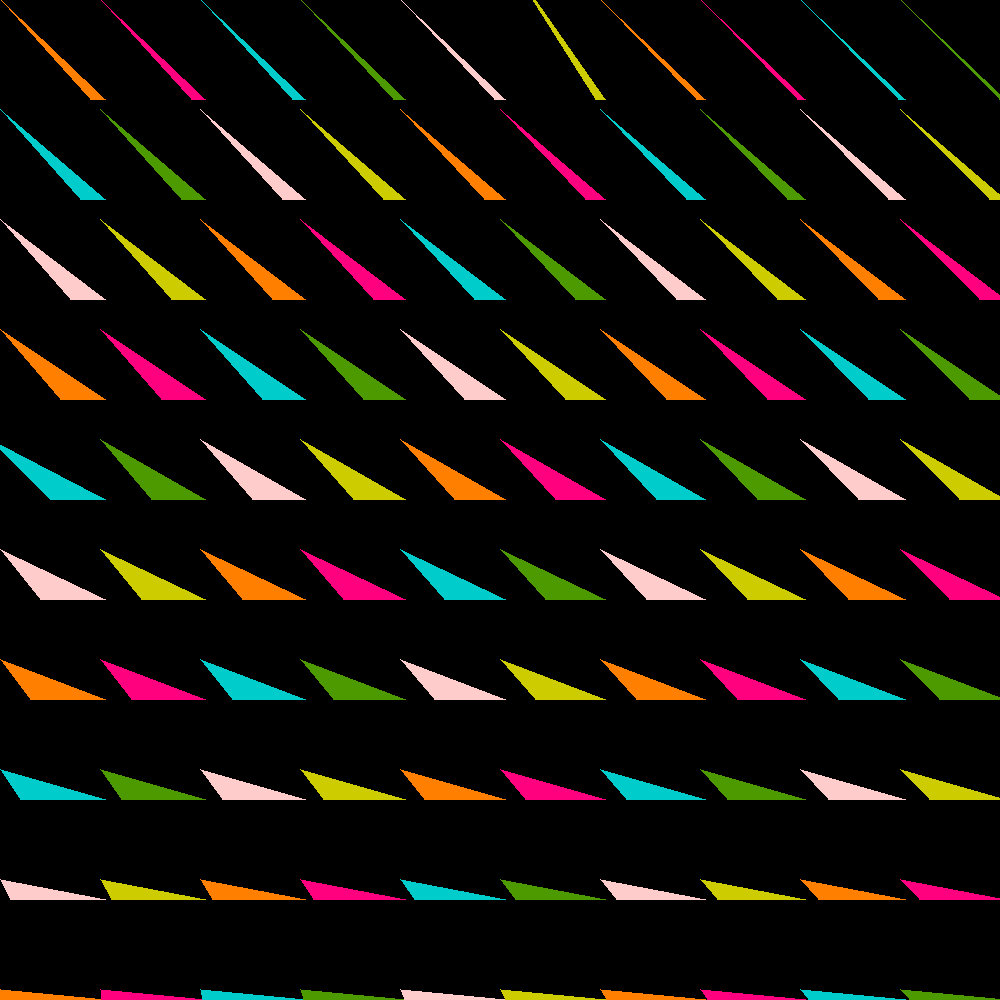
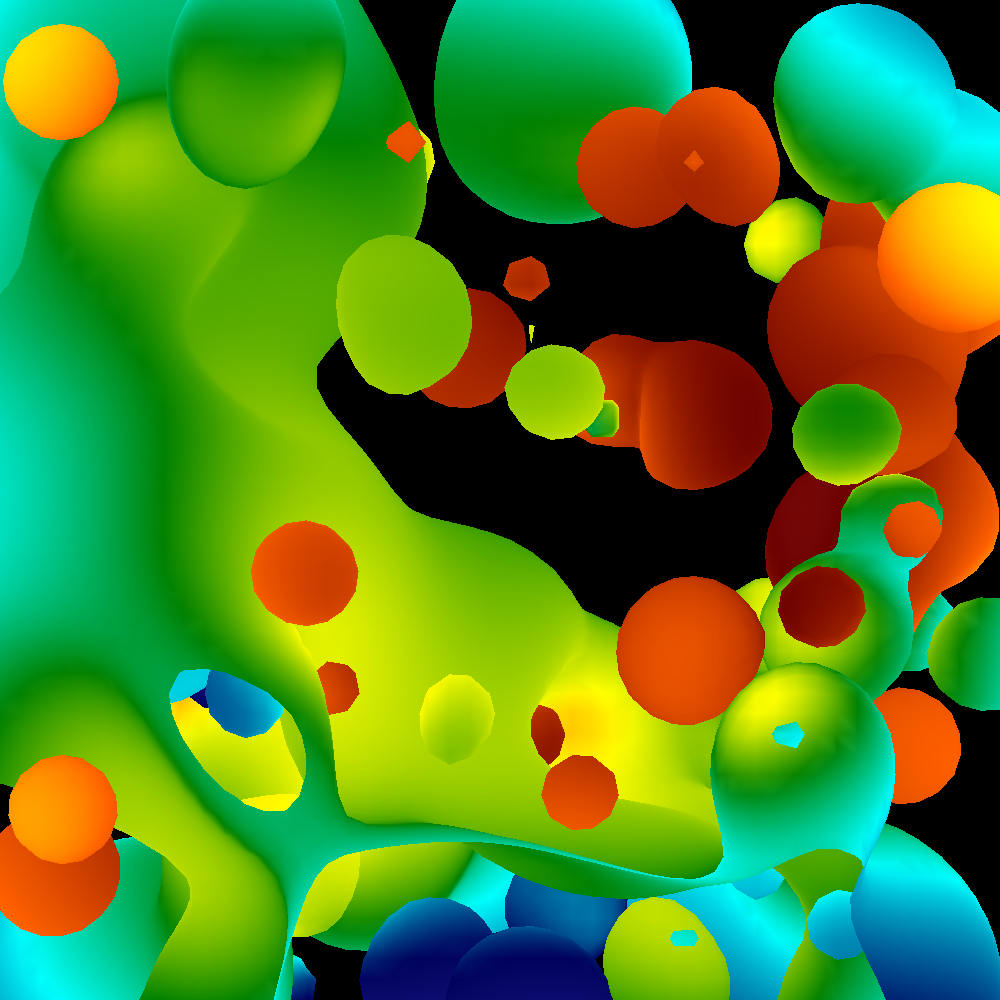
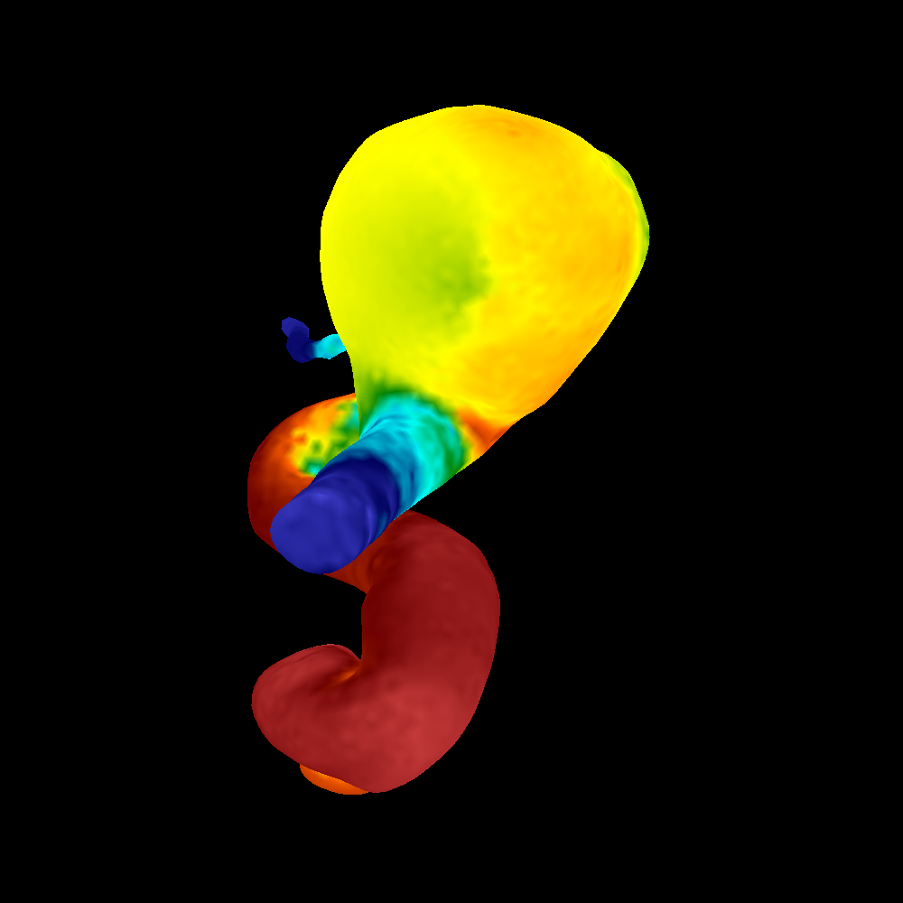

# CPU-Rasterizer
A CPU based computer graphics rasterizer built with C.

## Final Result (Part F)
### Aneurysm model rasterized with Phong shading and camera rotation.
https://www.youtube.com/shorts/x2kGc2y-U8w

## Part A
### Plotting colors and writing to a PNM file.

## Part B
### Rasterizing right triangles that go up.

## Part C
### Rasterizing arbitrary triangles. 

## Part D
### Z Buffer Algorithm and color interpolation

## Part E
### Camera transformation.

